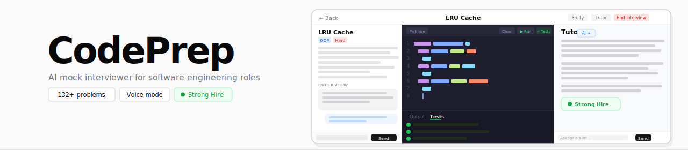
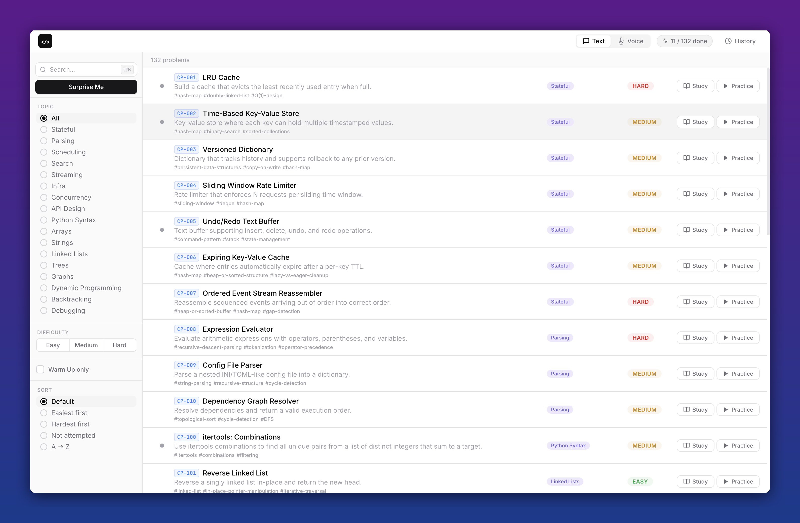
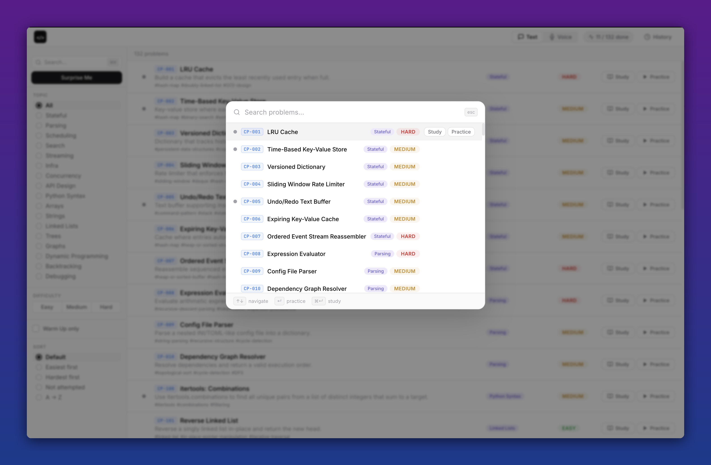
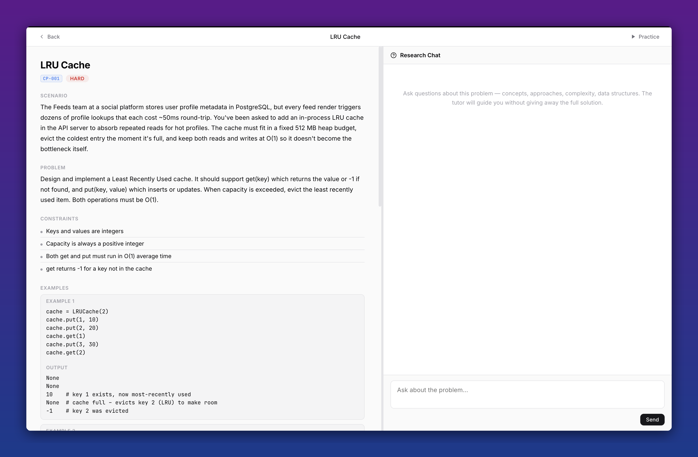
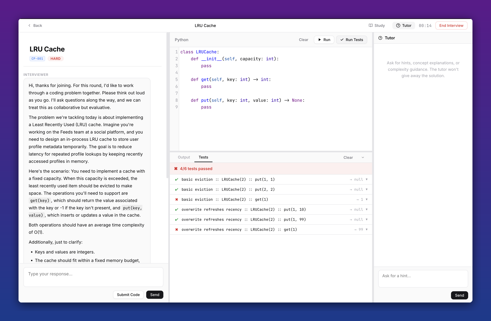
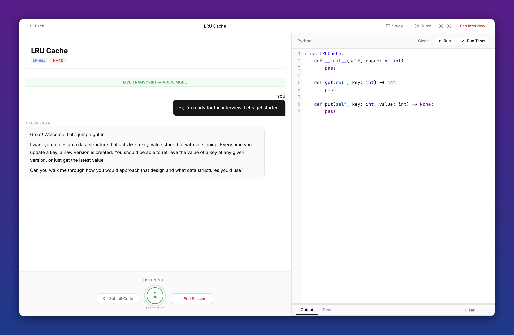
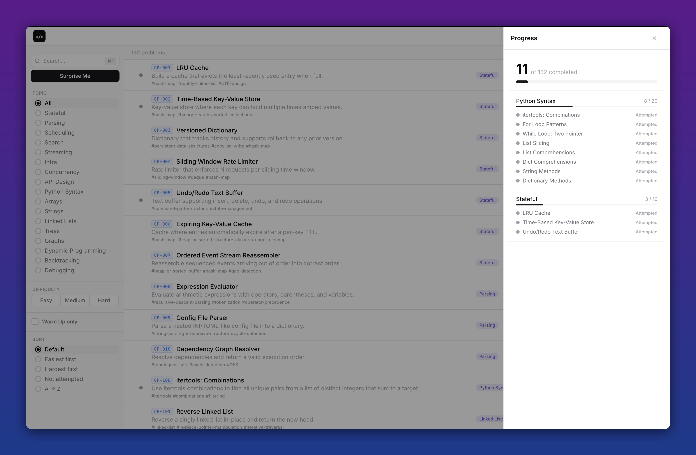

<div align="center">

[](https://www.python.org/downloads/)
[](https://platform.openai.com/)
[]()
[]()

</div>

---

## Why CodePrep

Most interview platforms are puzzle grinders. CodePrep puts you in a real interview.

- **A back-and-forth, not a quiz** - the interviewer follows up, pushes back on your reasoning, and adds constraints mid-session just like a real one would
- **Feedback that actually tells you something** - you get written scores and specific critique on your approach, code quality, communication, and tradeoffs - not just pass/fail
- **Everything stays on your machine** - sessions, history, and code are stored locally; nothing goes anywhere except your messages to OpenAI
- **Practice out loud** - voice mode lets you talk through your solution the way you would in an actual interview
- **132+ problems grounded in real engineering** - each one has a real-world scenario, not just "given an array..."

---

## Quick Start

```bash
git clone <repo-url>
cd codingprep
python3 -m venv venv && source venv/bin/activate
pip install -r requirements.txt
```

Create a `.env` file:

```
OPENAI_API_KEY=sk-your-key-here
```

```bash
python app.py
```

Open **http://localhost:5000** - that's it.

> **Prerequisites:** Python 3.8+, a paid OpenAI API key, and a modern browser (Chrome/Firefox/Safari).

---

## Table of Contents

- [Picking a Problem](#picking-a-problem)
- [Study Mode](#study-mode)
- [Running an Interview](#running-an-interview)
- [Voice Interviews](#voice-interviews)
- [Code Editor & Execution](#code-editor--execution)
- [How the Interviewer Works](#how-the-interviewer-works)
- [Your History & Progress](#your-history--progress)
- [Problem Library](#problem-library)
- [Keyboard Shortcuts](#keyboard-shortcuts)
- [FAQ](#faq)
- [Contributing](CONTRIBUTING.md)

---

## Picking a Problem



Browse and filter 132+ problems to find what you want to practice. Filters on the left let you narrow by category, difficulty, or whether you've attempted a problem before. Status dots on each card show how you've done - green for a hire signal, yellow for mixed, red for no hire.

Not sure what to pick? Hit **Surprise Me** to start a random interview from whatever's currently visible.

### Filters

**Search** - Filters by title, summary, or skills. `Cmd+K` / `Ctrl+K` opens a full command palette.

**Category tabs** - Filter by topic: stateful, parsing, scheduling, search, streaming, infra, concurrency, api_design, syntax, arrays, strings, linked lists, trees, graphs, dynamic programming, backtracking, debugging.

**Difficulty pills** - Multi-select: Easy, Medium, Hard.

**Warm Up toggle** - Shows only shorter, lower-stakes problems.

**Sort tabs** - Default, Easiest first, Hardest first, Not attempted, A-Z.

### From each problem you can

- Click **Study** to read it in full and chat with an AI tutor before committing to an interview
- Click **Practice** to jump straight into a mock interview
- Click a skill tag to filter the list to related problems

### Command Palette (`Cmd+K` / `Ctrl+K`)



Fuzzy search across all problem titles, summaries, skills, and categories. `Enter` to start Practice, `Cmd+Enter` / `Ctrl+Enter` to open Study Mode, `Escape` to close.

---

## Study Mode

Read a problem fully and chat with an AI tutor before you practice - useful when a topic is unfamiliar or you want to think through approaches first.



Two resizable panels side by side. The left panel has the full problem - scenario, constraints, examples, key skills, and follow-up challenges. The right panel is a tutor chat where you can ask anything about the problem without being handed the solution.

Good things to ask the tutor:

- "What data structure would work for O(1) lookup and O(1) deletion?"
- "What's the difference between BFS and DFS here?"
- "What edge cases should I consider?"

When you're ready, go back and hit **Practice** to start the interview.

---

## Running an Interview



Three panels: the interviewer chat on the left, your code editor in the center, and an optional tutor sidebar on the right. All dividers are draggable.

The interview runs like a real one - you'll clarify the problem, talk through your approach, then implement. The interviewer watches what you submit and responds to it. You can submit code multiple times; each submission gets reviewed.

### Submitting code

1. Write your solution in the editor
2. Click **Submit Code**
3. Your code runs against test cases automatically
4. Results appear in the chat (X/Y passed, with per-test details)
5. The interviewer reads the results and continues from there

### Stuck mid-interview?

Click **Tutor** in the top bar to open a hint sidebar. It runs separately from the interview conversation so you can ask for conceptual help without disrupting the flow. It won't give you the answer directly.

### At the end

The interviewer gives a structured debrief with a hire/no-hire rating, scores across dimensions like code quality, communication, and problem framing, and specific written feedback on what was strong, what was missing, and what a better answer would have looked like.

---

## Voice Interviews

Practice talking through your solution the way you actually would in an interview.



Switch to **Voice** mode in the toggle before starting. Once the interview begins, allow microphone access and wait for the connection. Your speech is transcribed live, the interviewer responds through your speakers, and everything is saved to your history just like a text session.

You can still write and submit code while in voice mode - just click **Submit Code** as normal.

### Troubleshooting

**Mic access denied** - Go to browser site settings for `localhost`, allow microphone, then reload.

**No audio from interviewer** - Check system audio output. Audio routes through the browser.

**Connection drops** - End the session and start a new one. Your previous session is preserved in History.

---

## Code Editor & Execution

Python editor with syntax highlighting, auto-closing brackets, line numbers, and smart indentation. Your code is auto-saved every 2 seconds - you won't lose it if you navigate away.

| Button | What it does |
|--------|--------|
| Run | Executes your code and shows stdout/stderr |
| Run Tests | Runs test cases against your solution and shows pass/fail per case |
| Clear | Clears the editor (asks for confirmation) |

> **Note:** Run Tests only works during an active interview - it uses the problem context to generate cases. Run Code works anytime.

---

## How the Interviewer Works

The interviewer runs a structured session, not a quiz. It asks you to clarify the problem, discuss your approach before you code, and then works through the implementation with you - adding constraints, asking follow-up questions, and adjusting based on what you say.

### What the session looks like

| Phase | What happens |
|-------|-------------|
| Opening | Problem is presented; you ask clarifying questions |
| Approach | You walk through your plan before writing any code |
| Implementation | You code; the interviewer interjects and follows up |
| Follow-ups | Harder constraints or variations if things are going well |
| Testing | You discuss edge cases and test coverage |
| Debrief | Structured feedback and a hire signal |

### Ratings

| Rating | What it means |
|--------|---------|
| Strong Hire | Exceptional performance |
| Hire | Solid; meets the bar |
| Lean Hire | Good with some gaps |
| Mixed | Some strengths, some concerns |
| Lean No Hire | Concerns outweigh strengths |
| No Hire | Did not meet the bar |

Written feedback covers: what was strongest, what would be a concern, what a better answer would have looked like, and 3 concrete areas to work on next.

---

## Your History & Progress

### Picking up where you left off

Click **History** in the top bar to see all past sessions. Click any entry to reload it - your messages and last submitted code are fully restored. You can continue the conversation from exactly where you stopped.

### Tracking what you've covered

Click the **X / Y done** chip to see your progress by category.



Each category shows a progress bar and lists the problems you've attempted with their ratings. Status dots on problem cards update as you practice:

- Empty - not attempted
- Green - Hire or Strong Hire
- Yellow - Lean Hire or Mixed
- Red - Lean No Hire or No Hire

---

## Problem Library

132+ problems across 18+ categories:

| Category | Focus |
|----------|-------|
| **Stateful** | LRU caches, time-based KV stores, undo/redo buffers, versioned state |
| **Parsing** | Config parsers, expression evaluators, template engines, dependency graphs |
| **Scheduling** | Task schedulers, rate limiters, job queues, interval merging |
| **Search** | File crawlers, in-memory search indexes, shortest path, autocomplete |
| **Streaming** | Moving averages, top-K frequent items, deduplication, windowed aggregation |
| **Infra** | Connection pools, retry with backoff, batch coalescing, circuit breakers |
| **Concurrency** | Thread-safe queues, worker pools, consistent hashing, rate-limited fetchers |
| **API Design** | Cursor pagination, query builders, plugin registries, diff/patch engines |
| **Python Syntax** | Loops, list comprehensions, slicing, built-in idioms |
| **Arrays** | Two sum, prefix sums, sliding window, binary search |
| **Strings** | Reversal, anagram detection, longest common prefix, pattern matching |
| **Linked Lists** | Reverse, merge sorted lists, cycle detection, nth from end |
| **Trees** | Level-order traversal, validate BST, lowest common ancestor, max path sum |
| **Graphs** | Number of islands, shortest path, topological sort, cycle detection |
| **Dynamic Programming** | Coin change, edit distance, longest increasing subsequence, knapsack |
| **Backtracking** | Subsets, permutations, N-Queens, word search |
| **Debugging** | Find and fix bugs in broken implementations |

### Each problem includes

- A real-world engineering scenario explaining why this problem comes up
- Alternative contexts that use the same pattern
- Formal problem statement and constraints
- 2-3 worked examples with input/output
- Key skills and follow-up challenges
- Starter code, pre-written test cases, and a full solution explanation with complexity analysis

---

## Keyboard Shortcuts

| Shortcut | Action |
|----------|--------|
| `Cmd+K` / `Ctrl+K` | Open command palette |
| `Escape` | Close palette, drawers, or modals |
| `↑` / `↓` (palette) | Navigate results |
| `Enter` (palette) | Start Practice on selected problem |
| `Cmd+Enter` / `Ctrl+Enter` (palette) | Open Study Mode |
| `Enter` (interview chat) | Send message |
| `Shift+Enter` | Insert newline |
| `Tab` (editor) | Insert 4 spaces |

---

## FAQ

**Do I need a paid OpenAI account?**
Yes. The interviewer uses GPT-4o, which requires a paid API key. Voice mode additionally uses the Realtime API.

**How much does each interview cost?**
Roughly $0.10-$0.50 per text session depending on length. Voice sessions cost more due to Realtime API audio pricing.

**Can I use other programming languages?**
Not currently. The code runner and test framework are Python-only.

**What happens if I close the browser mid-interview?**
The session is auto-saved every time you send a message or submit code. Open History to resume from where you left off.

**Can I retake the same problem?**
Yes. Multiple sessions on the same problem are tracked separately. The status dot reflects your best performance.

**Why is the feedback so detailed and critical?**
That's what makes it useful. Vague feedback doesn't help you improve. The debrief is written the way a hiring committee would actually talk about your performance.

**Where is my data stored?**
Entirely on your local machine in `user_data/sessions/`. Nothing is sent to external servers except your messages and code to OpenAI's API.

**Can I add my own problems?**
Yes - see [CONTRIBUTING.md](CONTRIBUTING.md) for the full problem YAML format.

---

## Contact

Questions or feedback? Reach out on [LinkedIn](https://linkedin.com/in/amruthagujjar).
