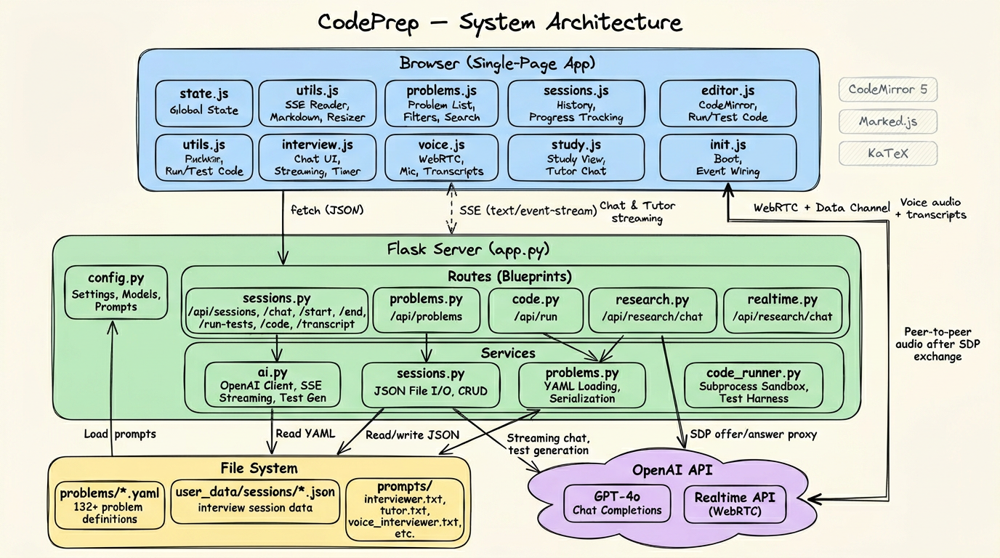

# Architecture



## Overview

CodePrep is a single-page Flask application that simulates technical coding interviews using OpenAI's GPT-4o. The browser handles all UI through vanilla JavaScript modules, the Flask server provides a JSON/SSE API backed by file-based persistence, and OpenAI powers both the text interviewer (via Chat Completions) and the voice interviewer (via the Realtime API over WebRTC).

There is no database — problems are YAML files loaded at request time, and sessions are JSON files written to disk. The entire application runs locally on the user's machine.

---

## System Layers

### Browser (Single-Page App)

The frontend is a single HTML page (`templates/index.html`) with nine JavaScript modules loaded in dependency order. There is no build step, no bundler, and no framework — just vanilla JS with global scope sharing.

| Module | Responsibility |
|--------|---------------|
| `state.js` | Mutable global state: current session, timer, filters, CodeMirror ref, WebRTC handles, transcript buffers |
| `utils.js` | Shared utilities: `escapeHtml`, `renderMarkdown` (Marked + KaTeX), `readSSEStream` (reusable SSE event reader), `buildTestResultsHtml`, `initResizer` (drag-to-resize panel factory) |
| `problems.js` | Problem list UI: fetch, filter, sort, render cards, command palette (`Cmd+K`), category/difficulty filtering |
| `sessions.js` | Session history: fetch past sessions, render history drawer, progress tracking by category, delete sessions |
| `editor.js` | Code editor: CodeMirror 5 (Python mode), auto-save on change, output panel, `POST /api/run` for execution, `POST /api/sessions/:id/run-tests` for test runs |
| `interview.js` | Interview flow: view switching, mode selection (text/voice), start/resume/end sessions, text chat with SSE streaming, code submission, timer, rating detection |
| `voice.js` | Voice mode: `getUserMedia`, `RTCPeerConnection` setup, data channel events, mic toggle, transcript accumulation, `POST .../transcript` to persist voice history |
| `study.js` | Study mode: problem detail rendering, research chat via SSE, tutor sidebar for mid-interview hints |
| `init.js` | Bootstrap: `DOMContentLoaded` wiring, CodeMirror init, filter/search/sort listeners, resizer hooks, API key check, keyboard shortcuts |

**Script load order:** `state` → `utils` → `problems` → `sessions` → `editor` → `interview` → `voice` → `study` → `init`

**External libraries** (loaded from CDN):
- CodeMirror 5.65 — Python editor with bracket matching and auto-close
- Marked 12.0 — Markdown rendering for chat messages
- KaTeX 0.16 — LaTeX math rendering inline and block

### Flask Server

The server is a thin routing layer that delegates all business logic to a `services/` package. `app.py` is a ~20-line factory that registers five Blueprints.

**Entry point:** `app.py` creates the Flask instance, mounts the index route, registers all blueprints from `routes/`, and starts the dev server using settings from `config.py`.

**Configuration:** `config.py` centralizes all settings — model names, temperature/token limits, directory paths, SSE headers, and all system prompts loaded from `prompts/` at import time.

### Routes (HTTP Layer)

Each Blueprint owns a group of related endpoints. Routes handle request parsing, response formatting, and SSE streaming — they do not contain business logic.

| Blueprint | Key Endpoints | Purpose |
|-----------|--------------|---------|
| `routes/sessions.py` | `GET /api/check-key`, `GET/POST /api/sessions`, `POST .../chat`, `POST .../start`, `POST .../end`, `POST .../run-tests`, `PUT .../code`, `POST .../transcript` | Full session lifecycle: create, load, chat (SSE streaming), start interview (SSE), submit code with test execution, save transcripts, end with evaluation |
| `routes/problems.py` | `GET /api/problems`, `GET /api/problems/:id` | Problem listing (with optional category filter) and full problem detail |
| `routes/code.py` | `POST /api/run` | Ad-hoc code execution outside of an interview (editor "Run" button) |
| `routes/realtime.py` | `POST /api/realtime/session` | WebRTC SDP proxy: accepts browser's SDP offer, forwards it to OpenAI's Realtime API with session config, returns SDP answer |
| `routes/research.py` | `POST /api/research/chat` | Study/tutor streaming chat via SSE |

### Services (Business Logic)

Services encapsulate all domain logic and external integrations. Routes import them as namespaces (`ai.get_client()`, `sessions.load()`, etc.).

| Service | Responsibility |
|---------|---------------|
| `services/ai.py` | OpenAI client singleton, streaming chat completions (`stream_chat`), SSE response generator (`sse_stream`), test case generation from conversation context (`generate_test_cases`) |
| `services/sessions.py` | JSON file CRUD for interview sessions — `create`, `load`, `save`, `delete`, `list_all`. Each session is a JSON file at `user_data/sessions/{id}.json` |
| `services/problems.py` | YAML problem loading (`load_all`), lookup by ID, serialization for list/detail views, and context builders for system prompts (`build_problem_block`, `build_study_context`) |
| `services/code_runner.py` | Python code execution sandbox: builds a temporary test harness embedding user code + test cases, runs it in a subprocess with a configurable timeout, parses structured results. Supports both function-based and class-based problems |

---

## Communication Patterns

### 1. JSON over fetch

Standard request-response for CRUD operations: loading problems, managing sessions, saving code, checking the API key. All responses are `application/json`.

### 2. Server-Sent Events (SSE)

Used for streaming interviewer and tutor responses in real time. The frontend's `readSSEStream` utility reads from a `fetch` response body, parsing `data:` lines with this protocol:

| Event | Payload | Meaning |
|-------|---------|---------|
| Content | `{"content": "..."}` | Incremental text chunk from the LLM |
| Test results | `{"test_results": {...}}` | Code execution results (passed/failed/errors) |
| Done | `{"done": true}` | Stream complete |
| Error | `{"error": "..."}` | Something went wrong |

SSE is used by three endpoints: `/api/sessions/:id/chat`, `/api/sessions/:id/start`, and `/api/research/chat`.

### 3. WebRTC (Voice Mode)

Voice interviews bypass the Flask server for audio. The flow:

1. Browser creates an `RTCPeerConnection`, adds a mic audio track, and opens a data channel named `oai-events`
2. Browser generates an SDP offer and sends it as the raw body of `POST /api/realtime/session`
3. Flask's `realtime.py` forwards the offer to OpenAI's Realtime API along with session configuration (model, voice, VAD settings, system prompt)
4. OpenAI returns an SDP answer; Flask passes it back to the browser
5. After the peer connection is established, audio flows directly between the browser and OpenAI — the Flask server is no longer in the path
6. The data channel carries structured events: transcript deltas, user speech transcription, and commands like `conversation.item.create` and `response.create`
7. Accumulated transcripts are periodically saved back to the session via `POST .../transcript`

---

## Data Model

### Problems (`problems/*.yaml`)

132+ YAML files, each defining a complete interview problem:

```yaml
id: 1
title: "LRU Cache"
category: "stateful"
difficulty: "Medium"
summary: "One-line description"
scenario: "Real-world engineering context..."
description: "Formal problem statement..."
constraints: [...]
examples: [...]
starter_code: "..."
key_skills: [...]
follow_ups: [...]
explanation: "Full solution walkthrough..."
test_type: "class"          # or "function"
class_name: "LRUCache"      # if class-based
function_name: "lru_cache"   # if function-based
test_cases: [...]            # pre-written test cases
```

Problems are loaded from disk on every request (`load_all()`) with no caching layer.

### Sessions (`user_data/sessions/*.json`)

Each session is a JSON file with this shape:

```json
{
  "id": "a1b2c3d4",
  "created_at": "2024-01-15T10:30:00",
  "updated_at": "2024-01-15T11:00:00",
  "focus": "stateful",
  "mode": "text",
  "status": "active",
  "problem_id": 1,
  "problem_title": "LRU Cache",
  "rating": null,
  "messages": [
    {"role": "system", "content": "..."},
    {"role": "assistant", "content": "..."},
    {"role": "user", "content": "..."}
  ],
  "code": "class LRUCache:\n    ..."
}
```

The full message history (including the system prompt) is stored and sent to OpenAI on every chat turn. The `rating` field is set when the interviewer's response contains a rating keyword (Strong Hire, No Hire, etc.).

### Prompts (`prompts/`)

| File | Config Key | Used For |
|------|-----------|----------|
| `interviewer.txt` | `SYSTEM_PROMPT` | Base system prompt for text interviews |
| `session_config.txt` | `SESSION_CONFIG` | Appended to interviewer prompt; also included in voice session instructions |
| `focus_prompts.json` | `FOCUS_PROMPTS` | Category-specific guidance when no specific problem is selected |
| `test_generation.txt` | `TEST_GEN_PROMPT` | Prompt for `generate_test_cases` — asks GPT to produce function name + test case JSON |
| `voice_interviewer.txt` | `VOICE_SYSTEM_PROMPT` | Voice-specific interviewer behavior (conciseness, pacing) |
| `tutor.txt` | `TUTOR_SYSTEM_PROMPT` | Study mode and mid-interview tutor — helps without giving away solutions |

All prompts are loaded once at import time by `config.py`.

---

## Code Execution

When a user runs code or submits it during an interview, the execution follows one of two paths:

### Ad-hoc Run (`POST /api/run`)

The user's raw Python code is written to a temp file and executed via `subprocess.run()` with a timeout. Stdout and stderr are captured and returned. This is used by the editor's "Run" button outside of test context.

### Test Execution (`POST /api/sessions/:id/run-tests`)

1. **Pre-canned tests first**: If the problem has `test_cases` in its YAML, `code_runner.run()` or `run_class()` is called directly with those cases
2. **AI-generated tests as fallback**: If no YAML tests exist (random topic interviews), `ai.generate_test_cases()` asks GPT to produce a function name and test cases from the conversation history, then runs them
3. **Harness construction**: `code_runner` builds a temporary Python file that imports the user's code, iterates over test cases, catches exceptions, and prints structured JSON results to stdout via a `__RESULTS__` marker
4. **Subprocess isolation**: The harness runs in a separate Python process with `config.CODE_TIMEOUT` (default 5 seconds). This provides process isolation and timeout protection, but is not a security sandbox

---

## Interview Flow (Text Mode)

```
User clicks "Practice"
    → POST /api/sessions (create session with system prompt + problem context)
    → POST /api/sessions/:id/start (SSE: interviewer opens with the problem)
    
User sends messages
    → POST /api/sessions/:id/chat (SSE: message appended, streamed reply)
    
User submits code
    → POST /api/sessions/:id/run-tests (runs tests, results injected into chat)
    → POST /api/sessions/:id/chat (SSE: interviewer responds to test results)
    
User ends interview
    → POST /api/sessions/:id/end (evaluation prompt added, SSE: final debrief)
```

## Interview Flow (Voice Mode)

```
User clicks "Practice" with Voice mode selected
    → POST /api/sessions (create session)
    → POST /api/realtime/session (SDP exchange, WebRTC established)
    → Data channel opens: synthetic kickoff message + response.create
    
User speaks
    → Audio flows directly to OpenAI via WebRTC
    → Interviewer responds via audio
    → Transcripts arrive via data channel events
    
User submits code
    → conversation.item.create sent via data channel with code + test results
    → response.create triggers interviewer reaction via audio
    
User ends interview
    → POST /api/sessions/:id/transcript (save accumulated transcript)
    → WebRTC connection closed, mic stream stopped
```

---

## Directory Structure

```
codingprep/
├── app.py                   # Flask app factory, index route, blueprint registration
├── config.py                # All settings, model names, prompt loading
├── services/                # Business logic
│   ├── ai.py                # OpenAI client, streaming, test generation
│   ├── sessions.py          # Session file I/O
│   ├── problems.py          # YAML problem loading and serialization
│   └── code_runner.py       # Subprocess code execution
├── routes/                  # HTTP layer (Flask Blueprints)
│   ├── sessions.py          # Session CRUD, chat, code, transcript endpoints
│   ├── problems.py          # Problem list and detail endpoints
│   ├── code.py              # Ad-hoc code execution endpoint
│   ├── realtime.py          # WebRTC SDP proxy for voice mode
│   └── research.py          # Study/tutor chat endpoint
├── templates/
│   └── index.html           # Single-page app shell + CDN library imports
├── static/                  # Flask-served app assets
│   ├── style.css
│   ├── favicon.*
│   └── js/                  # Frontend modules (9 files, ~2400 lines total)
├── prompts/                 # LLM system prompts (6 files)
├── problems/                # 132+ YAML problem definitions
├── user_data/
│   └── sessions/            # Persisted interview sessions (JSON)
├── docs/                    # Documentation and screenshots
└── .env                     # OpenAI API key (git-ignored)
```
